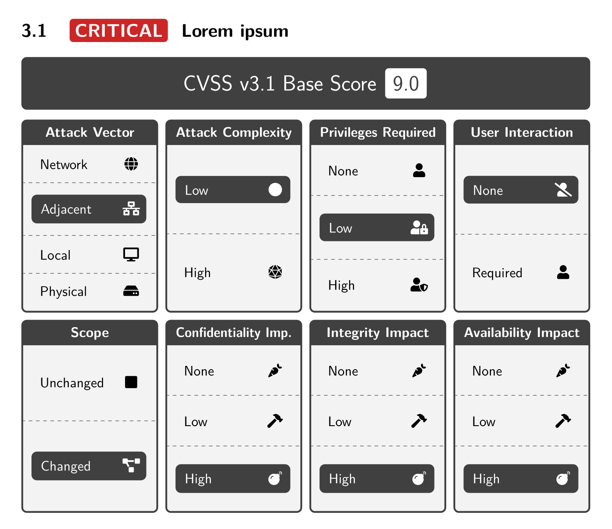
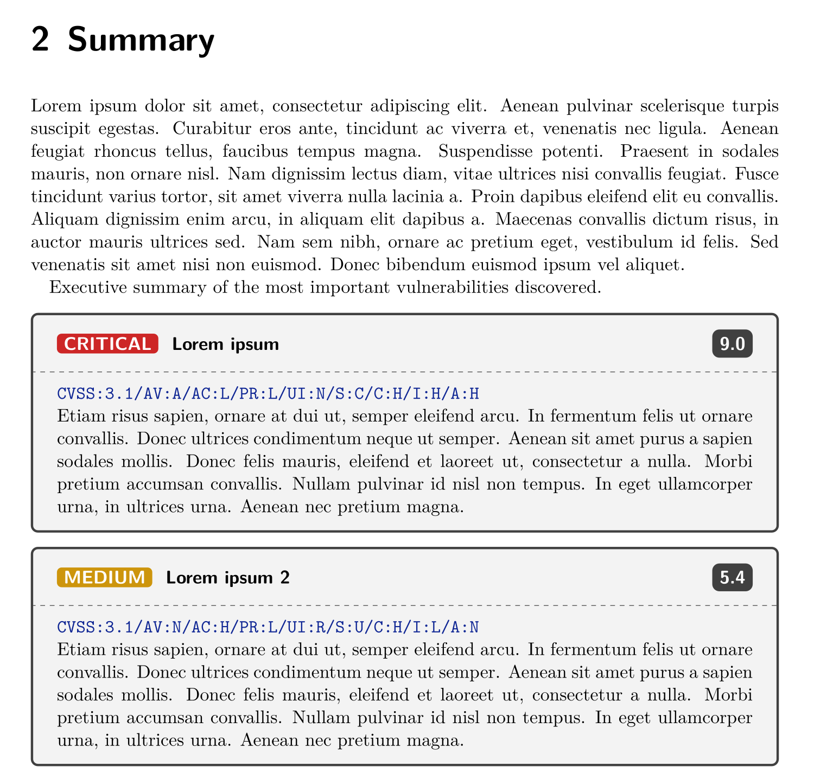

# Pentest report LaTeX template
A template for penetration testing reports based on the CVSS v3.1 scoring system (base score).

Features:

- Graphical representation of CVSS metrics
- Automatic calculation of CVSS score, severity and vector string based on inputted values
- Automatic generating of vulnerabilty "table of contents" for executive summary
- Severity badges
- Optimized for digital documents
- Simple, near-default design – easy to customize

**Requires LuaLaTeX.** Compile with:

```
lualatex -shell-escape main.tex
```

## Screenshots



For usage, see the sample document, or look below for quick summary.

## Usage summary

### Adding a vulnerability
```latex
% set CVSS values
\cvss{av=adjacent, ac=low, pr=low, ui=none, s=changed, c=high, i=none, a=none}

% alternative shorthand notation
% \cvss{av=a, ac=l, pr=l, ui=n, s=c, c=h, i=n, a=n}

% add description for summary
\cvssdescription{Etiam risus sapien, ornare at dui ut, semper eleifend arcu. In fermentum felis ut ornare convallis.}

% register vulnerability into summary with a specified title
\cvssaddtosummary{Lorem ipsum}

% Vulnerabilty title with severity badge
\section{\makecvssbadge Lorem ipsum}

% generate graphical CVSS values box
\makecvssbox

Actual content
```

### Generating summary
```latex
% insert at the beginning of the document in a summary section to 
% generate summary from registered vulnerabilities
\makecvsssummary
```

### Manually insert severity badges (each one takes parameters big/small which differ by padding)
```latex
\cvsscritical{big}
\cvsshigh{big}
\cvssmedium{big}
\cvsslow{big}
\cvssinfo{big}
```